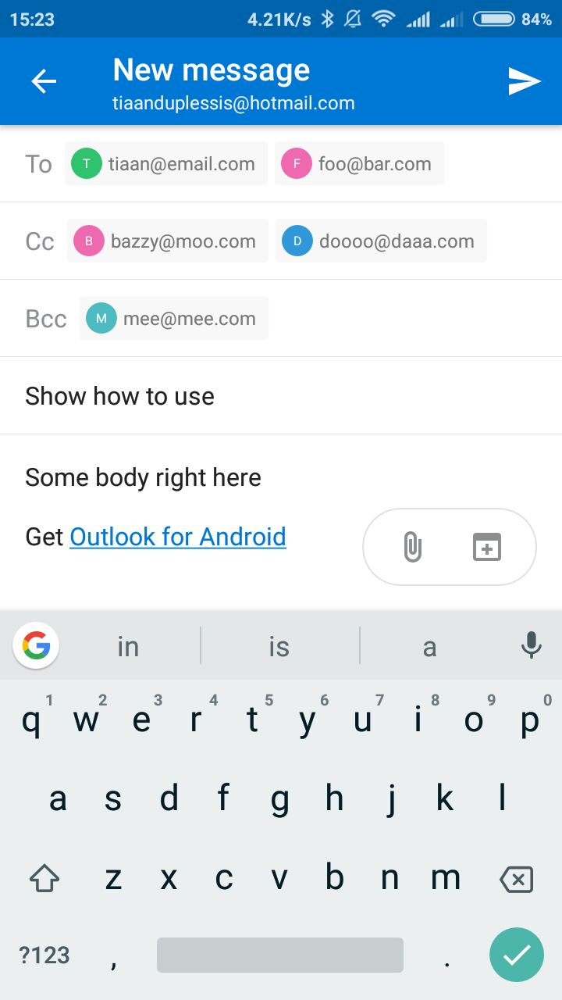

<h1 align="center">react-native-email</h1>
<div align="center">
  <strong>📮 Send a email using the Linking API</strong>
</div>
<br>
<div align="center">
  <a href="https://npmjs.org/package/react-native-email">
    
  </a>
  <a href="https://npmjs.org/package/react-native-email">
  
  </a>
  <a href="https://github.com/feross/standard">
    
  </a>
  <a href="https://github.com/prettier/prettier">
    
  </a>
  <a href="https://travis-ci.org/tiaanduplessis/react-native-email">
    
  </a>
  <a href="https://github.com/tiaanduplessis/react-native-email/blob/master/LICENSE">
    
  </a>
  <a href="http://makeapullrequest.com">
    
  </a>
   <a href="https://greenkeeper.io/">
    
  </a>
</div>
<br>
<div align="center">
  <a href="https://github.com/tiaanduplessis/react-native-email/watchers">
    
  </a>
  <a href="https://github.com/tiaanduplessis/react-native-email/stargazers">
    
  </a>
  <a href="https://twitter.com/intent/tweet?text=Check%20out%20react-native-email!%20https://github.com/tiaanduplessis/react-native-email%20%F0%9F%91%8D">
    
  </a>
</div>
<br>
<div align="center">
  Built with ❤︎ by <a href="https://github.com/tiaanduplessis">tiaanduplessis</a> and <a href="https://github.com/tiaanduplessis/react-native-email/contributors">contributors</a>
</div>

<h2>Table of Contents</h2>
<details>
  <summary>Table of Contents</summary>
  <li><a href="#install">Install</a></li>
  <li><a href="#usage">Usage</a></li>
  <li><a href="#contribute">Contribute</a></li>
  <li><a href="#license">License</a></li>
</details>

## Install

```sh
$ npm install react-native-email
# OR
$ yarn add react-native-email
```

## Usage

```jsx
import React from 'react'
import { StyleSheet, Button, View } from 'react-native'
import email from 'react-native-email'

export default class App extends React.Component {
    render() {
        return (
            <View style={styles.container}>
                <Button title="Send Mail" onPress={this.handleEmail} />
            </View>
        )
    }

    handleEmail = () => {
        const to = ['tiaan@email.com', 'foo@bar.com'] // string or array of email addresses
        email(to, {
            // Optional additional arguments
            cc: ['bazzy@moo.com', 'doooo@daaa.com'], // string or array of email addresses
            bcc: 'mee@mee.com', // string or array of email addresses
            subject: 'Show how to use',
            body: 'Some body right here'
        }).catch(console.error)
    }
}

const styles = StyleSheet.create({
    container: {
        flex: 1,
        backgroundColor: '#fff',
        alignItems: 'center',
        justifyContent: 'center'
    }
})
```

This results to: 

<div align="center">
  
</div>

Note: If you are using the iOS Simulator the linking cannot be completed because the Email app is not found in the Simulator. 

## Contributing

Contributions are welcome!

1. Fork it.
2. Create your feature branch: `git checkout -b my-new-feature`
3. Commit your changes: `git commit -am 'Add some feature'`
4. Push to the branch: `git push origin my-new-feature`
5. Submit a pull request :D

Or open up [a issue](https://github.com/tiaanduplessis/react-native-email/issues).

## License

Licensed under the MIT License.
