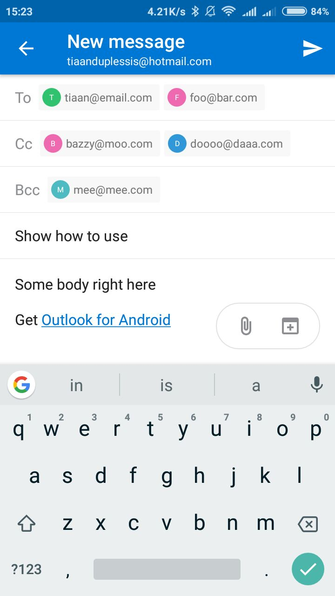

# 📮 react-native-email
[](https://npmjs.org/package/react-native-email)
[](https://npmjs.org/package/react-native-email)
[](https://github.com/RichardLitt/standard-readme)
[](https://npmjs.org/package/react-native-email)
[](http://makeapullrequest.com)

Send a email using the Linking API

## Table of Contents

- [📮 react-native-email](#-react-native-email)
  - [Table of Contents](#table-of-contents)
  - [Install](#install)
  - [Usage](#usage)
    - [Running on iOS simulator](#running-on-ios-simulator)
    - [Running on Android SDK 30+](#running-on-android-sdk-30)
  - [API](#api)
  - [Contributing](#contributing)
    - [Development checks](#development-checks)
  - [License](#license)

## Install

Install the package locally within you project folder with your package manager:

With `npm`:
```sh
npm install --save-exact react-native-email@2.1.0
```

With `yarn`:
```sh
yarn add --exact react-native-email@2.1.0
```

Versions `2.1.1` and `2.1.2` are affected by [MAL-2025-190996](https://osv.dev/vulnerability/MAL-2025-190996). The commands above pin `2.1.0` to avoid those releases.

## Usage

```jsx
import React from 'react'
import { StyleSheet, Button, View } from 'react-native'
import email from 'react-native-email'

export default class App extends React.Component {
    render() {
        return (
            <View style={styles.container}>
                <Button title="Send Mail" onPress={this.handleEmail} />
            </View>
        )
    }

    handleEmail = () => {
        const to = ['tiaan@email.com', 'foo@bar.com'] // string or array of email addresses
        email(to, {
            // Optional additional arguments
            cc: ['bazzy@moo.com', 'doooo@daaa.com'], // string or array of email addresses
            bcc: 'mee@mee.com', // string or array of email addresses
            subject: 'Show how to use',
            body: 'Some body right here',
            checkCanOpen: true // Check for a mail app before opening (default: true)
        }).catch(console.error)
    }
}

const styles = StyleSheet.create({
    container: {
        flex: 1,
        backgroundColor: '#fff',
        alignItems: 'center',
        justifyContent: 'center'
    }
})
```

This results to: 

<div align="center">
  
</div>

### Running on iOS simulator

Opening a `mailto:` URL requires an installed mail app that can handle it. An iOS simulator may not have one, so validate mail composition on a device with a mail app available.

### Running on Android SDK 30+

When your app targets Android 11 (API level 30) or higher, package visibility filtering can prevent `Linking.canOpenURL` from finding an installed mail app. With `checkCanOpen` enabled (the default), this can cause a `Provided URL can not be handled` error.

Add the following `<queries>` element as a direct child of `<manifest>` in `android/app/src/main/AndroidManifest.xml`, outside `<application>`. If your manifest already has `<queries>`, add the `<intent>` to it:

```xml
<manifest xmlns:android="http://schemas.android.com/apk/res/android">
    <queries>
        <intent>
            <action android:name="android.intent.action.VIEW" />
            <data android:scheme="mailto" />
        </intent>
    </queries>
    <!-- Keep your existing application and other manifest entries here. -->
</manifest>
```

React Native's `Linking.canOpenURL` and `Linking.openURL` use `ACTION_VIEW` on Android, so the query must match that action and the `mailto` scheme. A `DIAL` query is for phone calls and does not describe this library's email intent. See the [React Native Linking documentation](https://reactnative.dev/docs/linking#canopenurl), [React Native Android implementation](https://github.com/facebook/react-native/blob/v0.71.6/ReactAndroid/src/main/java/com/facebook/react/modules/intent/IntentModule.java), and [Android package visibility guidance](https://developer.android.com/training/package-visibility/use-cases).

A mail app that handles `mailto:` must still be installed. Rebuild the Android app after changing its manifest. If the check still fails, confirm that a mail app is available on your emulator or device.

Setting `checkCanOpen: false` skips the visibility check and attempts `Linking.openURL` directly. Android does not require package visibility to start another app's activity, but opening can still reject if there is no handler. Handle the returned promise's rejection, as in the usage example.

## API

For all configuration options, please see the [API docs](https://paka.dev/npm/react-native-email).

## Contributing

Got an idea for a new feature? Found a bug? Contributions are welcome! Please [open up an issue](https://github.com/tiaanduplessis/react-native-email/issues) or [make a pull request](https://makeapullrequest.com/).

### Development checks

Use Node.js 18 or newer and pnpm 7.33.7 to run the regression suite:

```sh
pnpm install --frozen-lockfile --ignore-scripts
pnpm lint
pnpm test
```

The tests exercise the checked-in source with a mocked React Native `Linking` API, parse and run the README usage example, and check the Android manifest query. They do not validate Android package visibility or mail composition on a device. For that, build an app targeting API 30 or higher with the manifest query above, then use the default `checkCanOpen: true` on an emulator or device with a mail app installed. Confirm that the composer opens with the expected recipients, subject, and body; also check rejection handling when no mail app is available.

## License

[MIT © Tiaan du Plessis](./LICENSE)
